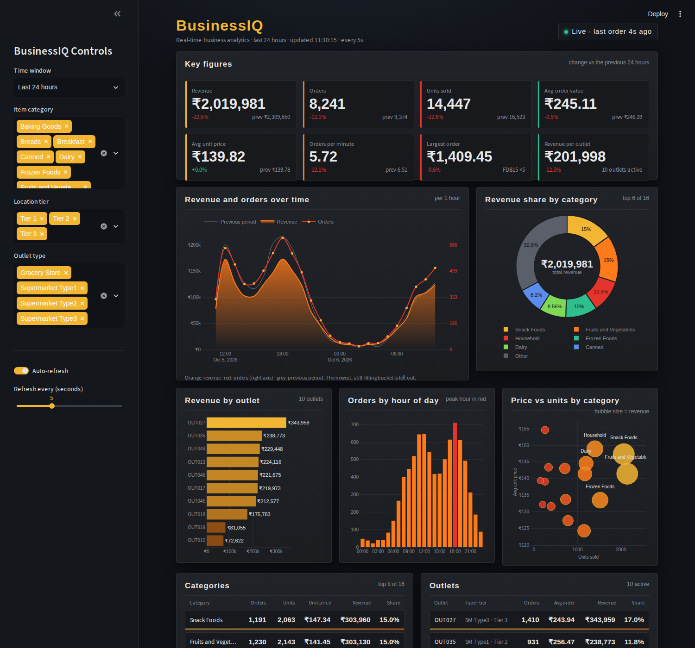

# BusinessIQ: Real-Time Business Analytics

A live dashboard that shows how a multi-outlet business is performing right now: revenue, orders, units, prices, best categories and best outlets, refreshed every few seconds and compared with the previous period.

**Live demo:** _add your Streamlit link here_



## What it answers

| Question | Where to look |
|---|---|
| How much did we sell in the last 15 min / hour / 24 h / 7 days / 14 days? | Key figures: Revenue, Orders, Units sold |
| Are we up or down compared with the period before? | Green/red change % and the previous value on every card |
| What does a typical order and a typical item cost? | Avg order value, Avg unit price |
| How busy are we right now? | Orders per minute, live badge, "Latest orders" |
| Which products earn the most? | Categories table: orders, units, unit price, revenue, share |
| Which outlets earn the most? | Outlets table: orders, average order, revenue, share |
| When are the peaks? | Revenue and orders over time, with the previous period as a grey line |

## The five graphs

| Graph | Type | What it shows |
|---|---|---|
| Revenue and orders over time | Area + line (two axes) | Money and order count per bucket, with the previous period as a grey line |
| Revenue share by category | Donut (pie) | Top 6 categories plus "Other", with total revenue in the centre |
| Revenue by outlet | Horizontal bars | Every outlet ranked by revenue, value labelled on each bar |
| Orders by hour of day | Column chart | Which hours are busiest (peak hour in red) |
| Price vs units by category | Bubble chart | Average unit price against units sold, bubble size = revenue |

Below the graphs, tables give the exact figures: categories, outlets and the latest orders with unit price and amount.

Sidebar filters (time window, item category, location tier, outlet type) change every number on the page. Any window can be exported to CSV.

## The numbers behind it

- **8,523** products across **10** outlets and **16** categories (Big Mart retail dataset), all kept after cleaning.
- Product prices range from **₹31** to **₹267** (average about **₹141**).
- About **6 orders a minute** are simulated live, busier at lunch and in the evening, quieter at night.
- A fresh build creates **14 days of history, about 121,000 orders**.
- A typical 24 hours is about **8,200 orders, ₹2.07 million revenue, 14,600 units, ₹251 average order**, about 1.76 units per order.
- Orders are **simulated** from the real product and outlet data. To use real sales, write them to the `orders` table (`order_time, sku_id, quantity, unit_price, sales_amount`).

## How it works

```
Excel data -> clean -> SQLite (catalog + orders) <- live feed adds ~6 orders/min
                                  |
                      Streamlit dashboard re-reads every 2-30 s
```

1. `core.clean_raw` fixes the raw data without dropping rows (3 clean fat-content labels instead of 5, missing weights filled, zero visibility replaced, all 10 outlets kept).
2. `core.build_database` creates the SQLite database and back-fills 14 days of orders.
3. `core.feed_loop` runs in a background thread and keeps inserting orders. If the app was asleep, it fills the gap on restart.
4. `dashboard.py` compares the chosen window with the previous window of the same length to calculate every change %.

## Run it locally

```bash
python -m venv .venv
# Windows:      .venv\Scripts\activate
# Mac / Linux:  source .venv/bin/activate

pip install -r requirements.txt
streamlit run python/dashboard.py
```

Run it from the project root so the dark theme in `.streamlit/config.toml` loads. The first start builds the database (about 10 seconds). Open http://localhost:8501.

Optional: `python python/build_database.py --days 30` rebuilds with a different history length. `python python/live_feed.py --speed 10` adds extra live traffic for demos.

## Deploy (free, Streamlit Community Cloud)

1. Push this folder to a public GitHub repo (`requirements.txt` stays at the repo root).
2. Go to https://share.streamlit.io, choose **Create app**, pick the repo and branch `main`.
3. Set **Main file path** to `python/dashboard.py`, choose Python 3.11, and click **Deploy**.

Free apps sleep when nobody visits. The first visitor wakes them in a few seconds, and the feed back-fills the gap.

## Project layout

```
python/config.py          settings: paths, currency, order rate, days of history
python/core.py            cleaning, database schema, order simulator
python/build_database.py  rebuild everything from the raw Excel file
python/live_feed.py       optional stand-alone order feed
python/dashboard.py       the Streamlit app
sql/analysis_queries.sql  six tested example queries
data/                     raw and cleaned Excel files
power bi/                 BusinessIQ_Data.pbix (older Power BI report)
legacy/                   earlier scripts and notebooks, kept for reference
```

Change the currency symbol with `CURRENCY` in `python/config.py`.

## Tech stack

Python, Streamlit, SQLite (WAL mode), pandas, NumPy, Plotly.
